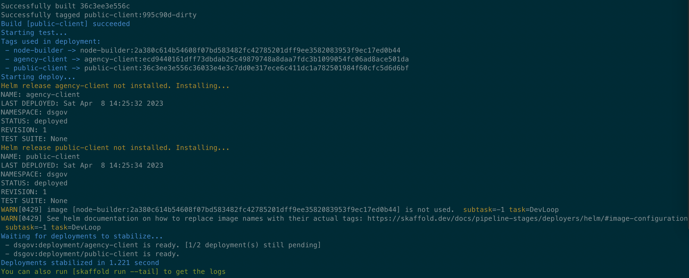

# Digital Suite for Government Web

This repo is a [NRWL NX](https://nx.dev) mono-repo that contains the application and libraries used in our DSGOV web portals

## Setup

Make sure the following prerequisites are installed

- Node
- NVM
- Yarn

These will automatically be installed via brew in our dev environment setup script found [here](https://github.com/dsgov-acme/devstream-local-environment#getting-started)

This project uses yarn package manager, install dependencies with `yarn install`

### Troubleshooting

This should not be necessary and is provided incase any issues with node versions are experienced.

NVM should automatically be setup for default shell profiles, if you see any issues with node version see [Homebrew NVM setup](https://formulae.brew.sh/formula/nvm)

If your shell profile is `~/.zshrc`, you will need to run the following bash commands

```shell
echo "export NVM_DIR=~/.nvm" >> ~/.zshrc && echo "source $(brew --prefix nvm)/nvm.sh" >> ~/.zshrc && source ~/.zshrc && nvm install 16 && nvm alias default 16 && nvm use 16
```

### Run locally (frontend-only)

- `yarn start ${appName}` - current appNames are `public`, and `agency`
  - This default configuration serves against the cloud development backends.
- Alternatively you can serve using any of the following environments:

  - Development
    - Use this environment by default for most development tasks
    - Serves against the cloud development backends
    - Serve with `yarn start ${appName} -c=dev`
  - Local
    - Use this environment if you are working on a new project that doesn't yet have a cloud backend setup or if you are working on tasks that require updating configurations
    - Serves against the local development backends
    - Serve with `yarn start ${appName} -c=local`
  - Personal

    - Use this environment if you need to override any environment values that are in the committed environment files
    - First create a new environment file in `apps/${appName}/src/environments/environment.personal.ts` with the following example file content:

      ```typescript
      import { IEnvironment } from '@dsg/shared/utils/environment';
      import { environment as environmentDefaults } from './environment.dev';

      export const environment: IEnvironment = {
        ...environmentDefaults,
        // override params here
      };
      ```

      - Note: this file is git ignored so you can customize your environments

    - Then serve with `yarn start ${appName} -c=personal`
    - This configuration is serving against the cloud dev backends by default and allows you to override any environment variables by updating the `environment.personal.ts` file

- `yarn nx storybook storybook-host` to launch storybook

### Deploy frontend to Minikube

1. If you haven't already, execute your OS's local env setup script [here](https://github.com/dsgov-acme/devstream-local-environment#getting-started)
   - NOTE: A minikube cluster will be provisioned as part of the script.
2. Run `skaffold run` at the root directory of the repo in your terminal.
3. Eventually, you should have something like this: 

To remove the deployed resources from minikube, run `skaffold delete`.

## Conceptual Angular Project

### Features

- Basic buildspec defined in cloudbuild.yaml
- Cypress e2e testing
- Jest unit testings
- ESlint with a strong set of rules defined
- Accessibility linting and test patterns defined
- Storybook for demo and documentation
- Prettier pre-commit with Husky
- Commit Lint pre-commit with Husky
- GitHub actions to lint and test code

It is recommended to use the cli for code generation, [NX console](https://nx.dev/l/r/getting-started/console) is a good editor plugin for doing this.

#### Storybook

This project uses storybook for component examples, documentation, and testing.

- Github Actions builds the Storybook artifacts
- Pushes to the storybook branch (this branch only contains the storybook static assets)
- Storybook build artifacts are deployed to GH Pages from the storybook branch

See Storybook portal at <https://dsgov-acme.github.io/devstream-web>

---

## Contributing

1. Clone the repo
2. Create a feature branch: `git checkout -b feature/my-new-feature`
3. Commit your changes
4. Push to that branch: `git push origin feature/my-new-feature`
5. Submit a pull request

### Husky & Commit Lint

[Husky](https://typicode.github.io/husky/#/) is a plugin which allows us to connect into git hooks. We are using it along with [commitlint](https://commitlint.js.org/#/) to check our commit messages before actually committing to git. There will be a git error thrown if you are not adhering to the common commit syntax, as well as the following custom rules:

- May contain a scope `type(scope): description`

- A scope SHOULD be kebab-case and is generally the story id `type(dsg-###): description`

---

## Contributors

---

## Configuration Parameters

Here are the key configuration parameters for the application:

### Helm

#### Network

- host: `<host-domain-name>`
- applicationPort: `<k8s-application-container-port>`
- livenessPath: `<k8s-liveness-probe-path>`
- readinessPath: `<k8s-readiness-probe-path>`

#### environmentJSON

```yaml
environmentJSON: {
  authenticationConfiguration: {
    firebaseConfiguration: {
      firebase: {
        apiKey: `<firebase-api-key-from-the-console>`,
        authDomain: `<firebase-auth-domain>`,
      },
      tenantId: `<identity-platform-tenant-id>`,
    },
    sessionExpiration: {
      idleTimeSeconds: `<idle-time>`,
      sessionTimeSeconds: `<session-time>`,
    },
  },
  httpConfiguration: {
    baseUrl: `<api-base-url>`,
  },
}
```
